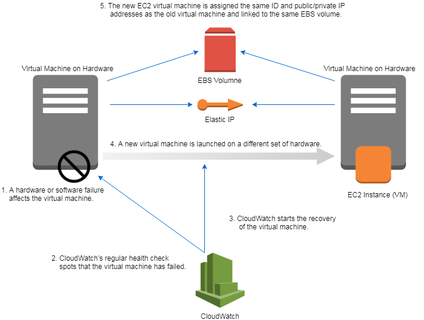

# AWS-JenkinsSetup-HA-AZ-AutoScaling
Jenkins HA (High Availability) Setup - Recovering from EC2 instance failure with CloudWatch - Handling Data Center Outage with Auto Scaling

Setting up a Jenkins server for a high-availability. 

There are 2 approaches that were followed in this project from cost perspectives:

● Handling EC2 Failures within a region with CloudWatch

● Handling Entire Data center outage with Auto-Scaling and having the provision of EFS ad Elastic IP

### Approach 1: Handling EC2 Failures within a region with CloudWatch
The EC2 service checks the status of each virtual machine automatically. System status checks are executed every minute and the results are available as CloudWatch metrics. A system status check detects a loss of network connectivity or power, as well as software or hardware issues on the physical host.

1. The physical hardware fails and causes the EC2 instance to fail as well. 
2. The EC2 service detects the outage failure and reports it to a CloudWatch metric.
3. A CloudWatch alarm triggers recovery of the virtual machine.
4. The EC2 instance is launched on another physical host machine.
5. The EBS volume and Elastic IP stay the same, and are linked to the new EC2instance.

After the recovery, a new EC2 instance will be running with the same ID and private IP address. Data on network-attached EBS volumes is available as well. No data is lost because the EBS volume stays the same. EC2 instances with local disks (instance storage) aren’t supported for this process. If the old EC2 instance was linked to an Elastic IP address, the new EC2 instance will be linked to the same Elastic IP address.

The program works as follows:

• A virtual machine with user data containing a Shell script installs a Jenkins server during bootstrapping

• A public IP address assigned to the EC2 instance to access the new instance after a recovery using the same public IP address as before

• A CloudWatch alarm based on the system status metric published by the EC2 service

The Jenkins server runs on a virtual machine with automated recovery. If the virtual machine fails because of issues with the host system, it will be recovered with all data and the same public IP address. The URL doesn’t change because the use of Elastic IP for the virtual machine. All data is restored because the new virtual machine uses the same EBS volume as the previous virtual machine.

### Approach 2: Handling Entire Data center outage with Auto-Scaling and having the provision of EFS ad Elastic IP

Auto-Scaling feature was also added to handle the failure of one availability zone and migrate over next availability zone. EFS service is used to replicate the data automatically between availability zones in a region. Elastic IP allocated and associated this public IP address during the virtual machine’s bootstrap for network interface recovery so that Jenkins server can be available under the same endpoint which was allocated earlier before failure.

